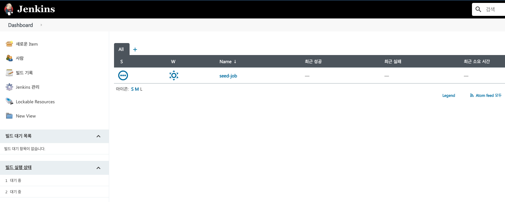
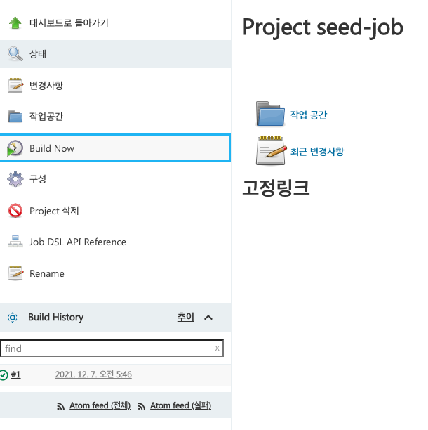

# 1 Jenkins Docker로 설치하기

* gradle을 사용해서 젠킨스 컨테이너 실행 자동화
  * 인프라 설정을 코드로 제어하자!
* 파일 구성(리포지토리의 루트에 전부 존재)
  * Dockerfile: 젠킨스 이미지 빌드를 위한 파일
  * plugins.txt: 젠킨스에 설치할 플러그인을 명시한 텍스트 파일
  * seedJob.xml: 젠킨스 시작시 기본적으로 존재하는 시드 잡
  * createJobs.groovy: 생성할 잡을 명시하는 파일
  * build.gradle: `com.palantir.docker` 플러그인을 사용하여 이미지를 만들고 실행할 수 있다. 즉 코드로 이미지 만들고 실행 가능
  * gradle, gradlew, gradlew.bat, settings.gradle: gradle 프로젝트 생성시 자동 생성


## 1.1 Dockerfile

**Dockerfile**

* Docker In Docker 방식
* 젠킨스 컨테이너에서 Docker 명령어를 실행하기 위해 젠킨스 이미지에 도커를 설치한다.

```dockerfile
FROM jenkins/jenkins:2.303.3-jdk11

# Jenkins Docker image에 Docker 설치
USER root
RUN curl -sSL https://get.docker.com/ | sh
RUN usermod -a -G docker jenkins
USER jenkins

# plugins.txt에 설치하고자 하는 플러그를 명시하고 install-plugins.sh을 통해 설치
COPY plugins.txt /usr/share/jenkins/ref/plugins.txt
RUN /usr/local/bin/install-plugins.sh < /usr/share/jenkins/ref/plugins.txt

# 젠킨스 기본 시드잡 설정 파일 카피
COPY seedJob.xml /usr/share/jenkins/ref/jobs/seed-job/config.xml

# 설치 위자드 비활성화
ENV JAVA_OPTS -Djenkins.install.runSetupWizard=false
```


## 1.2 plugins.txt

* 아래와 같이 필요한 플러그인 명시

```
authorize-project:1.4.0
job-dsl:1.78.1
workflow-aggregator:2.6
git:4.5.0
```


## 1.3 seedJob.xml

* 젠킨스 초기 실행시 시드 잡을 설정하는 파일
* 시드 잡은 깃 리포지토리에서 `createJobs.groovy` 를 가져와 실행하는 역할을 한다.
  * `<url>이곳에 리포지토리 url 명시</url>`
* 시드 잡을 빌드하면 `createJobs.groovy` 의 정의된 잡들이 만들어진다.

```xml
<?xml version='1.1' encoding='UTF-8'?>
<project>
  <description></description>
  <keepDependencies>false</keepDependencies>
  <properties/>
  <scm class="hudson.plugins.git.GitSCM" plugin="git@4.2.2">
    <configVersion>2</configVersion>
    <userRemoteConfigs>
      <hudson.plugins.git.UserRemoteConfig>
        <url>https://github.com/raiders032/jenkins-demo.git</url>
      </hudson.plugins.git.UserRemoteConfig>
    </userRemoteConfigs>
    <branches>
      <hudson.plugins.git.BranchSpec>
        <name>*/master</name>
      </hudson.plugins.git.BranchSpec>
    </branches>
    <doGenerateSubmoduleConfigurations>false</doGenerateSubmoduleConfigurations>
    <submoduleCfg class="list"/>
    <extensions/>
  </scm>
  <canRoam>true</canRoam>
  <disabled>false</disabled>
  <blockBuildWhenDownstreamBuilding>false</blockBuildWhenDownstreamBuilding>
  <blockBuildWhenUpstreamBuilding>false</blockBuildWhenUpstreamBuilding>
  <triggers/>
  <concurrentBuild>false</concurrentBuild>
  <builders>
    <javaposse.jobdsl.plugin.ExecuteDslScripts plugin="job-dsl@1.77">
      <targets>createJobs.groovy</targets>
      <usingScriptText>false</usingScriptText>
      <sandbox>false</sandbox>
      <ignoreExisting>false</ignoreExisting>
      <ignoreMissingFiles>false</ignoreMissingFiles>
      <failOnMissingPlugin>false</failOnMissingPlugin>
      <failOnSeedCollision>false</failOnSeedCollision>
      <unstableOnDeprecation>false</unstableOnDeprecation>
      <removedJobAction>IGNORE</removedJobAction>
      <removedViewAction>IGNORE</removedViewAction>
      <removedConfigFilesAction>IGNORE</removedConfigFilesAction>
      <lookupStrategy>JENKINS_ROOT</lookupStrategy>
    </javaposse.jobdsl.plugin.ExecuteDslScripts>
  </builders>
  <publishers/>
  <buildWrappers/>
</project>

```

컨테이너 실행 후 젠킨스에 접속하면 아래와 같이 위에서 설정한 시드 잡이 있다.



시드 잡을 빌드



createJobs.groovy에 정의한 잡이 만들어 진다.


## 1.4 createJobs.groovy

* createJobs.groovy는 seedJob이 실행되면 잡을 만드는 역할을 한다.
* 명시된 깃 리포지토리 url에서 Jenkinsfile을 읽어 잡을 만든다.
  * 따라서 타켓 리포지토리 루트에 Jenkinsfile을 작성해야한다.

```groovy
pipelineJob('theme-park-job') {
    definition {
        cpsScm {
            scm {
                git {
                    remote {
                        url 'https://github.com/raiders032/spring-boot-api-example.git'
                    }
                    branch 'master'
                }
            }
        }
    }
}
pipelineJob('theme-park-job-docker') {
    definition {
        cpsScm {
            scm {
                git {
                    remote {
                        url 'https://github.com/raiders032/spring-boot-api-example.git'
                    }
                    branch 'master'
                    scriptPath('Jenkinsfile-docker')
                }
            }
        }
    }
}
```


## 1.5 grade 프로젝트 생성

**gradle 프로젝트 초기화 진행**

* gradle 설치 후 진행

```bash
$ gradle init --type basic
$ ls
Dockerfile        build.gradle      gradle            gradlew.bat       seedJob.xml
README.md         createJobs.groovy gradlew           plugins.txt       settings.gradle
```


**build.gradle 수정**

* build.gradle를 아래와 같이 수정한다.

```groovy
import org.gradle.nativeplatform.platform.internal.DefaultNativePlatform

plugins {
    id 'base'
    id 'com.palantir.docker' version '0.31.0'
    id 'com.palantir.docker-run' version '0.31.0'
    id 'pl.allegro.tech.build.axion-release' version '1.13.6'
}

project.version = scmVersion.version

docker {
    name "${project.name}:${project.version}"
    files "plugins.txt", "seedJob.xml"
}

Process process
if (DefaultNativePlatform.getCurrentOperatingSystem().isWindows()) {
    process = "docker run --rm -v /var/run/docker.sock:/var/run/docker.sock alpine stat -c %g /var/run/docker.sock".execute()
} else if (DefaultNativePlatform.getCurrentOperatingSystem().isLinux()) {
    process = "stat -c %g /var/run/docker.sock".execute()
} else {
    throw new GradleException("Unsupported operating system. No way to find group of /var/run/docker.sock.")
}

def out = new ByteArrayOutputStream()
process.waitForProcessOutput(out, System.err)
String dockerSockGroupId = out.toString().trim()

String extraPrefix = DefaultNativePlatform.getCurrentOperatingSystem().isWindows() ? '/' : ''
dockerRun {
    name "${project.name}"
    image "${project.name}:${project.version}"
    ports '8080:8080'
    clean true
    daemonize false
    arguments '-v', "$extraPrefix/var/run/docker.sock:/var/run/docker.sock", '--group-add', dockerSockGroupId
}

```


**Jenkins 컨테이너 실행**

```bash
./gradlew build docker dockerRun
```


# 2 애플리케이션 설정

* CI/CD를 적용할 애플리케이션의 깃 리포지토리 설정
* 이 애플리케이션은 그래들 스프링 부트를 이용해서 만들어짐


## 2.1 **Jenkinsfile**

* 리포지토리 루트에 Jenkinsfile을 작성한다.
* 젠킨스는 createJobs.groovy의 명시된 리포지토리에서 Jenkinsfile을 가져와 잡을 만든다.

```groovy
pipeline {
    agent any

    triggers {
        pollSCM '* * * * *'
    }
    stages {
        stage('Build') {
            steps {
                sh './gradlew assemble'
            }
        }
        stage('Test') {
            steps {
                sh './gradlew test'
            }
        }
        stage('Build Docker image') {
            steps {
                sh './gradlew docker'
            }
        }
        stage('Push Docker image') {
            environment {
                DOCKER_HUB_LOGIN = credentials('docker-hub')
            }
            steps {
                sh 'docker login --username=$DOCKER_HUB_LOGIN_USR --password=$DOCKER_HUB_LOGIN_PSW'
                sh './gradlew dockerPush'
            }
        }
    }
}
```


## 2.2 Dockerfile

* 젠킨스가 애플리케이션의 이미지를 빌드하는데 필요한 dockerfile 작성

```dockerfile
# 스프링 부트 애플리케이션 예시
FROM openjdk:11
ARG JAR_FILE
COPY ${JAR_FILE} app.jar
ENTRYPOINT ["java", "-jar", "/app.jar"]
```


참고

* https://tomgregory.com/building-a-spring-boot-application-in-jenkins/#1_Creating_a_Spring_Boot_application